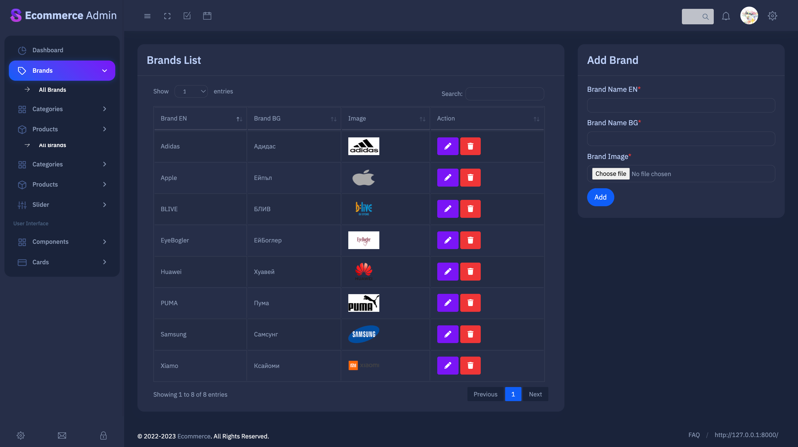
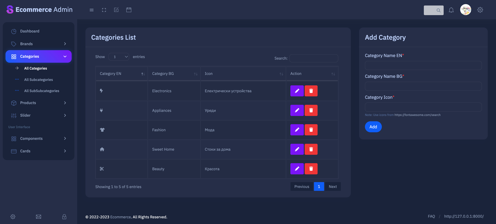
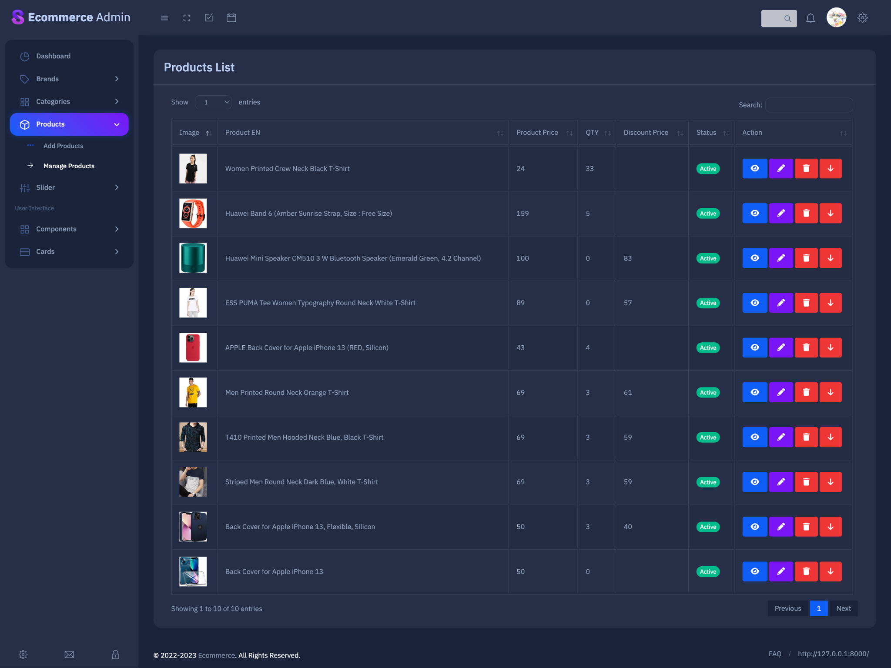
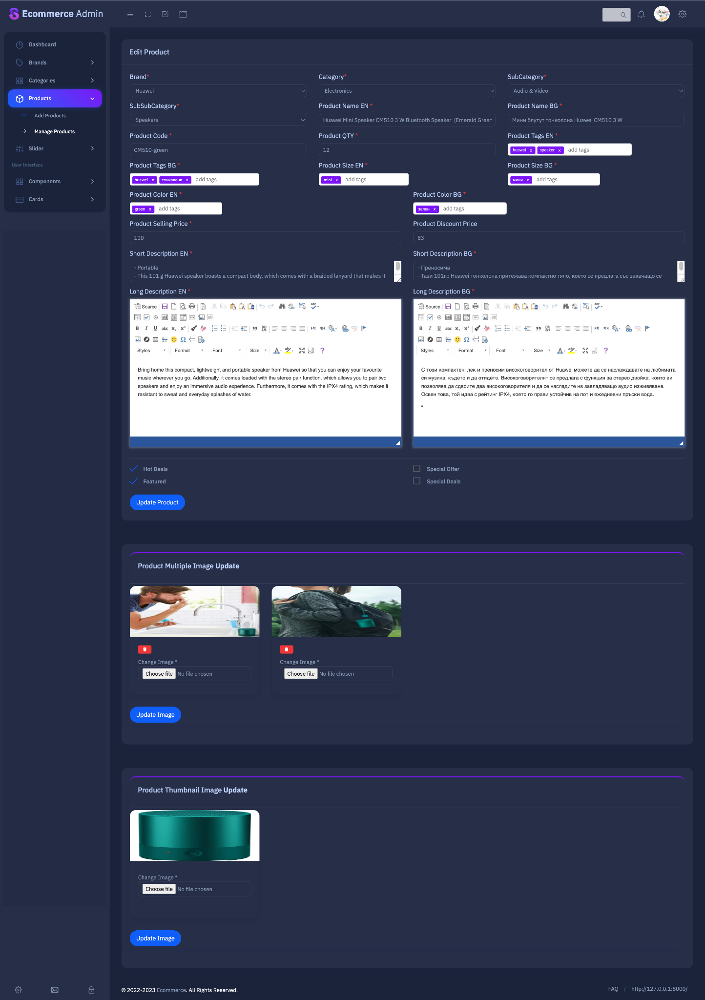
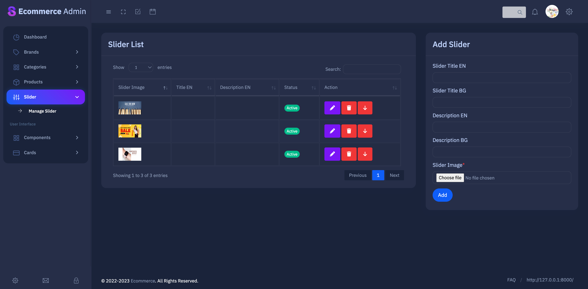

# Ecommerce system
> Fully operational ecommerce project build with Laravel 8. Features like MultiAuthentication system (admin panel and user login), PayPal integration, Multilanguage, Coupon system, Invoice generating with PDF and much more are implemented.

## Table of Contents
* [General Info](#general-information)
* [Technologies Used](#technologies-used)
* [Features](#features)
* [Screenshots](#screenshots)
* [Setup](#setup-for-local-environment)
* [Project Status](#project-status)
* [Contact](#contact)
<!-- * [License](#license) -->

## General Information
- Fully operational ecommerce project build with Laravel 8. Fetures like MultiAuthentication system (admin panel and user login), PayPal integration, Multilanguage, Coupon system, Invoice generating with PDF and much more are implemented.

## Technologies Used
- Laravel - [version 8.83.18](https://laravel.com/docs/8.x)
- Bootstrap - 
- Jquery - 
- Popper - 

## Features
- MultiAuthentication system - [JetStream package](https://jetstream.laravel.com/2.x/introduction.html)
- ToastrJS library for non-blocking notifications - [version 2.1.4](https://cdnjs.com/libraries/toastr.js)
- Intervention Image package for handling images - [version 2](https://intervention.io/)
- SweetAlert2 for pop-up boxes - [version 11.4.33](https://github.com/sweetalert2/sweetalert2)
- bumbummen99/shoppingcart - [version 4.2.0](https://packagist.org/packages/bumbummen99/shoppingcart)

## Detailed description
### MultiAuthentication system 
- Admin register, Admin login, Admin Forget password
- User register, User login, User Forget password

### Admin Panel
- Admin profile - Change profile image, Change email, Change username, Change password
- Brands - CRUD
- Categories - CRUD
- SubCategories - CRUD
- SubSubCategories - CRUD
- Products - CRUD (Separated in two sections: Add Product, Manage products)
- Slider - CRUD

### User Panel

### Frontend Home Page
- Multiple languages
- Categories, Subcategories, SubSubCategories inside Navigation Bar and Side menu
- Sidebar with multiple tabs: Categories, Subcategories, SubSubCategories, Hot deals, Special offers
- Dynamical main Slider
- Multiple Tabs: New products, Featured products, Dynamically selected Category
- Showing Products with titles, prices, discount prices, add to card, add to wishlist, tags ont the image,
- Quick view and Quick order of a product

### Single Product page
- Multiple languages
- Dynamical product images, title, price, discount price, availabilaty, short description, description, select quantity option, select color option, select sizeopcion
- Related products section

## Screenshots

## Setup for local environment
- Install and configurate [Laravel 8.*](https://laravel.com/docs/8.x)

## Project Status
Project is: _in progress_

## Contact
Created by [@Lilyana Vankova](https://github.com/Lilyah) - feel free to contact me!

<!-- Optional -->
<!-- ## License -->
<!-- This project is open source and available under the [... License](). -->

<!-- You don't have to include all sections - just the one's relevant to your project -->
